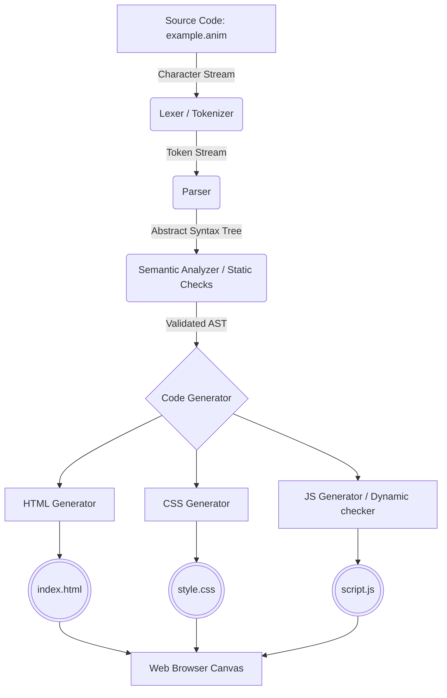

# Animora Architecture

The Animora framework is broadly divided into two main environments: the **OCaml-based Compiler Pipeline** that processes the DSL, and the **Web-based Runtime Environment** (HTML5 Canvas + JavaScript).

---

## High-Level Architecture Flow

The following flowchart outlines the journey of an Animora script from source code to a fully functioning browser animation:

---

## Core Components

### 1. Lexical Analyzer (Tokenizer)
- **Location:** `lib/tokenizer/`
- **Responsibility:** Reads the raw `.anim` source text character by character and groups them into meaningful, discrete symbols known as **Tokens**. This strips out whitespace and comments, identifying keywords, operators, and literals.

### 2. Parser
- **Location:** `lib/parser/`
- **Responsibility:** Consumes the token stream to verify algorithmic grammar rules. It constructs an **Abstract Syntax Tree (AST)**—a hierarchical tree representation of the program's structure. The parser ensures that tokens follow the expected grammar patterns.

### 3. Semantic Analyzer & Static Checks
- **Location:** `lib/static_check/`
- **Responsibility:** Cross-references the generated AST for logical validity before attempting code generation. Tasks include:
  - **Variable Resolution:** Ensuring variables are declared before use.
  - **Scope Checking:** Validating block and function scopes.
  - **Type Inference (Basic):** Making sure fields matching expected constraints (e.g. `animate` targeting valid dot-notation fields).

### 4. Dynamic Checks & Security
- **Location:** `lib/dynamic_Checks/`
- **Responsibility:** Injects runtime safety mechanisms into the resulting translation. This ensures operations that cannot be evaluated purely at compile-time do not silently crash the program in the browser.
  - **Runtime Guards:** Wrapping division-by-zero, out-of-bounds array access, and modulo-by-zero.

### 5. Code Generator
- **Location:** `lib/code_gen/`
- **Responsibility:** The backend of the compiler that bridges the gap between the AST and the browser. This component recursively walks the validated AST to construct three distinct web assets:
  - **HTML Generator (`html_gen.ml`):** Scaffolds the boilerplate HTML5 structure, mounts the `<canvas>` tag, and incorporates configurations like `fps`.
  - **CSS Generator (`css_gen.ml`):** Injects boilerplate styles ensuring the canvas correctly sits in the viewport and resolves background colors.
  - **JS Generator (`js_gen.ml` & `emit_*.ml`):** Translates Animora statements, tween directives, mathematical expressions, object declarations, and event listeners directly into valid ES6 JavaScript.

### 6. The Browser Execution Runtime
When the output HTML file is opened in a browser alongside its CSS and JS siblings:
- The injected **JavaScript Runtime** uses `requestAnimationFrame` configured via the user's `fps` setting.
- Built-in functions (`random`, `dist`) are evaluated.
- Declarative `animate` blocks are powered by a custom tween-engine scaffold.
- The `window.onkeydown` or `canvas.onclick` listeners interpret the runtime interactions defined by the `on` directives.
