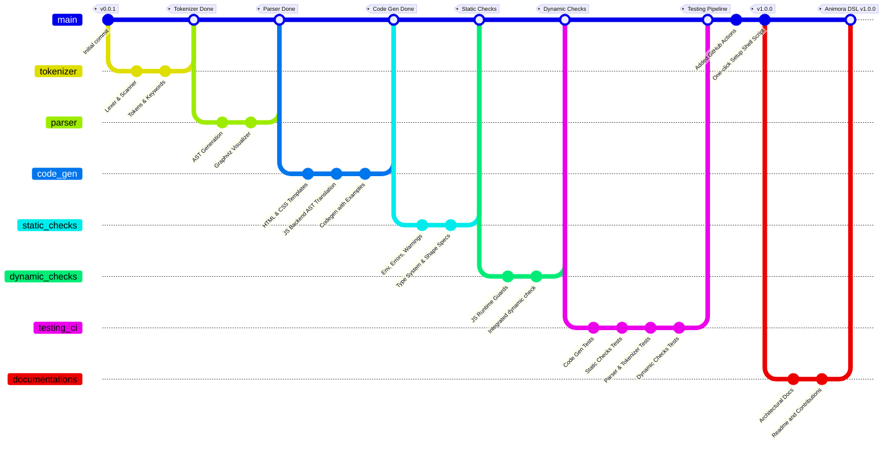

# Developmental Flow

This diagram outlines the major milestones in the development of the Animora DSL, from the initial setup to the continuous integration and documentation steps.

```mermaid
gitGraph
    commit id: "Initial commit" tag: "v0.0.1"
    branch tokenizer
    checkout tokenizer
    commit id: "Lexer & Scanner"
    commit id: "Tokens & Keywords"
    checkout main
    merge tokenizer tag: "Tokenizer Done"

    branch parser
    checkout parser
    commit id: "AST Generation"
    commit id: "Graphviz Visualizer"
    checkout main
    merge parser tag: "Parser Done"

    branch code_gen
    checkout code_gen
    commit id: "HTML & CSS Templates"
    commit id: "JS Backend AST Translation"
    commit id: "Codegen with Examples"
    checkout main
    merge code_gen tag: "Code Gen Done"

    branch static_checks
    checkout static_checks
    commit id: "Env, Errors, Warnings"
    commit id: "Type System & Shape Specs"
    checkout main
    merge static_checks tag: "Static Checks"

    branch dynamic_checks
    checkout dynamic_checks
    commit id: "JS Runtime Guards"
    commit id: "Integrated dynamic check"
    checkout main
    merge dynamic_checks tag: "Dynamic Checks"

    branch testing_ci
    checkout testing_ci
    commit id: "Code Gen Tests"
    commit id: "Static Checks Tests"
    commit id: "Parser & Tokenizer Tests"
    commit id: "Dynamic Checks Tests"
    checkout main
    merge testing_ci tag: "Testing Pipeline"

    commit id: "Added GitHub Actions"
    commit id: "One-click Setup Shell Script" tag: "v1.0.0"

    branch documentations
    checkout documentations
    commit id: "Architectural Docs"
    commit id: "Readme and Contributions"
    checkout main
    merge documentations tag: "Animora DSL v1.0.0"
```
